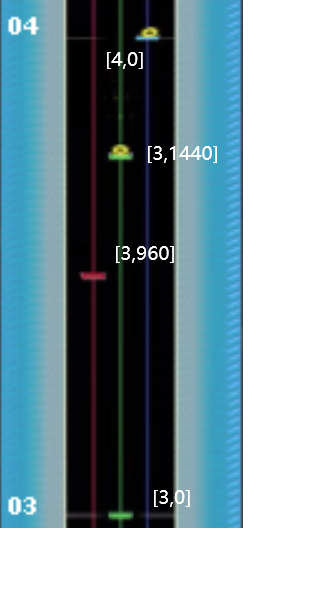
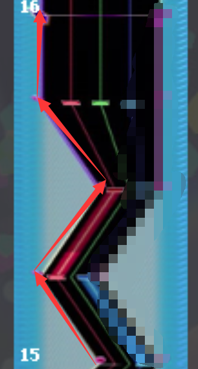

## 简介
这里是部分谱面内容或者命令的相对详细的解释。因为是本人的理解，以下内容并不保证内容准确。若有错误，务必提醒(

<br/>
<br/>
<br/>
<br/>

### TGrid -> TimeGrid?
```
为了方便表示,TGrid的表示为 T[tUnit,tGrid,ResT = 1920] ，ResT若为默认的1920即可不用写,比如有一个TGrid的tUnit为28,tGrid为57且ResT默认1920,那么此TGrid可以表示为 T[28,57] 
```
不同于osu那种谱面物件基于绝对时间值(即5000就是第5秒,以此类推)的物件时间，音击谱面采用的是类似与Be-music Source那种基于节拍相对位置的时间表示机制。<br/>
音击物件摆放时间的设置都依赖于TGrid这个玩意。TGrid的计算有两个(半)变量:`tUnit`、`tGrid`(和TGrid不同意思)、`ResT`,为啥有半个变量捏，是因为ResT绝大部分情况下是默认1920不变。他们的计算关系相当简单:
``` 
tGrid = tUnit * ResT<br/>
假设ResT为1920<br/>
那么 T[1,0] 等同于 T[0,1920] , [0.5,0] 等同于 [0,960]
```
由此可见这种表示机制会造成无法直观查看物件实际对应的音乐时间，需要通过此TGrid对应的当前Bpm以及前面的Bpm变化才能推算出来。在音击谱面显示中，一个tUnit单位长度就有一个半透明线,因此可以通过实际谱面图片和谱面文件对照去理解TGrid[tUnit,tGrid]的含义。<br/>


```
TAP	217	3	0	0	0
TAP	74	3	960	-8	0
TAP	217	3	1440	0	0
TAP	357	4	0	8	0
```

<br/>
<br/>
<br/>
<br/>

### Bullet Pallete List 位置简单理解
Shoot.TargetHead是从指定的位置 placeHit 发出子弹;
placeHit:
* 如果Target是FixField , 则placeHit应该是对应实际子弹的xUnit (即子弹从正上方笔直落下)
* 如果Target是Player , 则placeHit应该是玩家的位置(?)

<br/>
<br/>
<br/>
<br/>

### *Start -> *Next -> *End
有出现很多关于这些相关的命令，它们都是按GroupId/RecordId为一组的物件集合。一组命令必须以`Start`开始,再以`End`结束,其中间可以塞多个`Next`物件。比如Lane(即红蓝绿线以及墙等)通过此机制可以连续画曲折的线。

```
WLS	4	15	0	0
WLN	4	15	480	-24
WLN	4	15	960	0
WLN	4	15	1440	-24
WLE	4	16	0	-24
```
