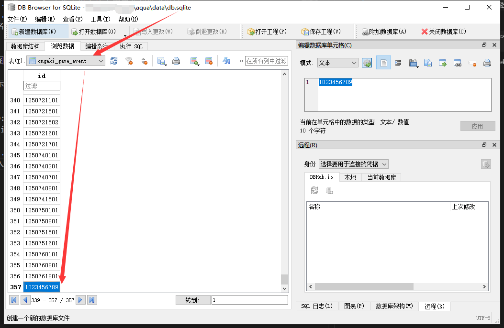

## 自制谱面包示范
----
### 简介
这里将会提供一个最小的文件集合(谱面包)示范来描述音击是如何加载谱面的。 
各个文件夹里面可能有不同的Readme文档，来描述谱面不同部分的细节，建议开搞前请先读完所有的Readme文档。

### 示例谱面包整体文件结构概览
<pre>
│   Readme.md  <--- 你正在读的文档 ^_^
│
├───mu3_Data 
│   └───StreamingAssets
│       ├───assets
│       │       ui_jacket_0999    //谱面封面,后缀数字为谱面id
│       │       ui_jacket_0999_s    //谱面大图封面
│       │       Readme.md
│       └───Sound
│               music0999.acb    //谱面音频文件描述文件
│               music0999.awb    //谱面音频文件本体
│               Readme.md
└───option
    └───A688    //option文件,后缀数值范围 000 ~ 999
        │   DataConfig.xml    //option包描述文件
        │
        ├───event
        │   └───event1023456789    //事件，后缀11位数字的事件id,且不能和其他已有事件id冲突
        │           Event.xml    //通过事件描述文件,可以添加/注册谱面文件及内容(但需要服务器支持)
        │
        └───music 
            └───music0999    //谱面文件夹,后缀为谱面id且在Music.xml钦定
                    0999_00.ogkr    //谱面文件
                    0999_01.ogkr
                    0999_02.ogkr   
                    0999_03.ogkr
                    Music.xml    //谱面信息文件
</pre>

### 谱面用法(需要aqua配合支持)

1. 将example各个文件夹覆盖到游戏对应的位置
2. 使用或编译本项目tools/AssetsByteUpsertHelper,将谱面封面的文件名注册到游戏的资源列表上,用法:

> AssetsByteUpsertHelper.exe asset.bytes文件路径 新增的封面文件图片名1 新增的封面文件图片名2 ...

示例

> AssetsByteUpsertHelper.exe D:\\summer\\package\\mu3_Data\\StreamingAssets\\assets ui_jacket_0999 ui_jacket_0999_s

这里的ui_jacket_0999和ui_jacket_0999_s便是新添谱面的封面图片文件名了 
3. 打开aqua的数据库文件**db.sqlite**，在ongeki_game_event表格插入新的数据,值为支持的事件id(比如上面的1023456789)

4. 打开aqua,打开游戏,enjoy.

