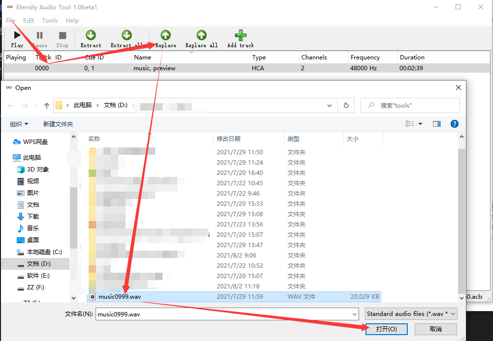
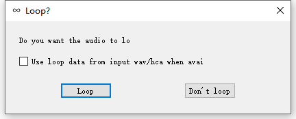

## 谱面音频
----
音击的谱面音频文件使用CriAtomCraft.ver3制作打包而成。因为实在不知道打包生成音频的.acb/.awb文件所需参数是什么，因此只能通过awb文件替换的方式去实现自制谱面音频文件。

### 如何替换谱面音频文件成自己的
1. 从`package\mu3_Data\StreamingAssets\Sound`随便拿成对的music????.acb和music????.awb，复制到其他的地方.
2. 下载[Eternity Audio Tool](https://animegamemods.freeforums.net/thread/618/eternity-audio-tool-link-tutorial),打开`eternity_audio_tool.exe`,打开刚才复制好的`music????.acb`
3. 选择唯一的内容列表项，然后点击工具栏的`Replace按钮`,选择你要替代的自制谱面音频文件(建议wav格式48000hz) 

4. 如果出现 
 
则选择`Loop`按钮
5. 双击列表项可以播放替换后的音频文件。如果确认已被替换，则保存退出程序。
6. 将替换好的.acb和.awb改文件名，改成自己自制谱面的musicId再塞回Sound文件夹
7. all done,enjoy

### .acb简单描述
一份谱面音频.acb文件部分信息会引用.acf文件 , .acb文件里面包含两个cue:
* **cueId = 0** , 名字`music` , 对应.acf类型为`Music` ， 表示谱面整体音频内容
* **cueId = 1** , 名字`preview` , 对应.acf类型为`Preview Music` , 表示选曲预览时循环播放的音频内容

### .awb超简单描述
没啥好说的，就是将音频文件外置成文件(一般情况下音频文件内嵌到.acb文件中)